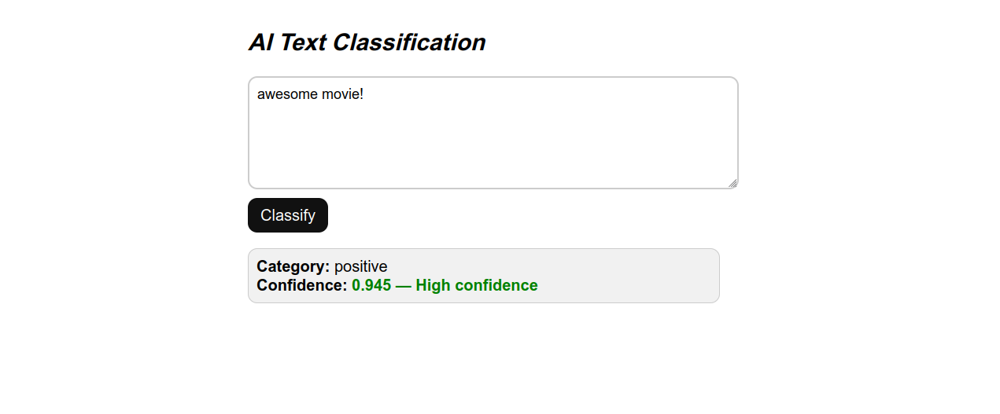

# Text Classifier

A simple text classification model


## App Preview

<!--  coming soon -->
*Above: The interactive Swagger UI showing the available API endpoints.*


## Key Features

* **Text preprocessing:**.
* **TF-IDF → Logistic Regression model:**.


## Tech Stack

* **Language:** Python 3.10+
* **Framework:** FastAPI
* **Web Server:** Uvicorn
* **Library:** Scikit learn


## Getting Started

### 1. Prerequisites
Ensure you have Python 3.10 or higher installed.

### 2. Installation
```bash
# Clone the repository
git clone https://github.com/Chimereya/text-classifier.git
cd your-repo

# Create and activate virtual environment
python -m venv venv
source venv/bin/activate  # Windows: venv\Scripts\activate

# Install dependencies
pip install -r requirements.txt

# Run local server
uvicorn main:app --reload
